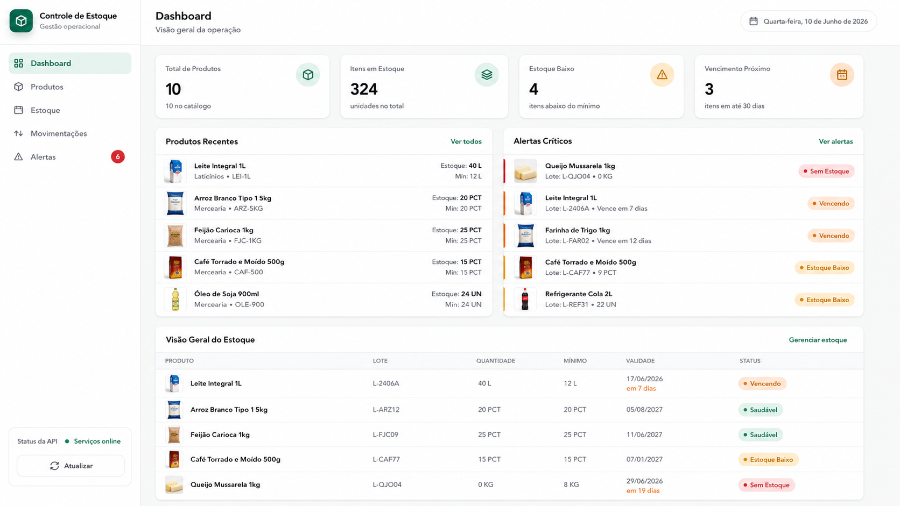

# Inventory Control API

Sistema de controle de estoque, validade e reposicao para pequenos comercios.

## Problema escolhido

Pequenos mercados, mercearias, restaurantes e lanchonetes perdem dinheiro por falta de controle de estoque, produtos proximos do vencimento, estoque minimo mal acompanhado e registros manuais de entrada e saida.

## Solucao

A solucao e uma aplicacao web com dois microsservicos:

- `product-service`: cadastro, consulta, atualizacao e soft delete de produtos.
- `inventory-service`: controle de itens de estoque, entradas, saidas, estoque baixo e vencimento proximo.

O frontend em HTML/CSS/JS puro consome as APIs reais e apresenta dashboard, tabelas, formularios, alertas e status dos servicos.

## Stack

- Python
- FastAPI
- Pydantic
- SQLAlchemy
- SQLite
- Pytest
- Behave/Gherkin
- Docker
- HTML/CSS/JS puro

## Conceitos obrigatorios demonstrados

- Clean Code
- SOLID
- Design Patterns
- TDD
- BDD
- Arquitetura Limpa
- Microsservicos
- Docker
- Deploy

## Arquitetura

Cada microsservico segue Arquitetura Limpa, separando responsabilidades em camadas:

- `domain`: entidades, contratos de repositorio e regras centrais de negocio.
- `application`: casos de uso, schemas, factories e mappers.
- `infrastructure`: banco SQLite, SQLAlchemy e implementacoes de repositorios.
- `presentation`: rotas FastAPI e tratamento de erros HTTP.

Design Patterns usados:

- Repository
- Factory
- Mapper
- Strategy

## Banco de dados

Cada microsservico possui seu proprio banco SQLite:

- `services/product-service/data/products.db`
- `services/inventory-service/data/inventory.db`

Os arquivos `.db` sao gerados em ambiente local e ignorados pelo Git.

## Execucao com Docker

```bash
docker compose build
docker compose up -d
```

Servicos:

- product-service: <http://localhost:8081>
- inventory-service: <http://localhost:8082>

Endpoints principais:

- `GET http://localhost:8081/api/products`
- `GET http://localhost:8082/api/stock-items`

Encerrar:

```bash
docker compose down
```

## Frontend

Para abrir o frontend estatico:

```bash
cd frontend
python -m http.server 3000
```

Acesse:

```text
http://localhost:3000
```

Funcionalidades principais:

- Dashboard com cards de produtos, itens, estoque baixo e vencimento proximo.
- Cadastro de produtos.
- Cadastro de itens de estoque.
- Registro de entrada e saida.
- Tabelas de produtos e estoque.
- Alertas de estoque baixo e validade.
- Status visual dos servicos.

## Exemplo visual

A imagem abaixo mostra um exemplo de como o sistema pode funcionar em um pequeno comercio real, como mercadinhos de bairro, ajudando no acompanhamento de produtos, estoque, validade e reposicao.



Observacao: para integracao completa com as APIs usando a mesma origem, o projeto tambem possui `frontend/serve.py`, que serve o frontend e faz proxy para os backends.

## Testes

```bash
cd services/product-service
pytest
python -m behave
```

```bash
cd services/inventory-service
pytest
python -m behave
```

Resumo atual:

- Testes unitarios/API com pytest: 27 no total.
- Cenarios BDD com Behave/Gherkin: 12 no total.

## Deploy

O deploy final ainda e um plano a realizar. A proposta e publicar os microsservicos conteinerizados em uma plataforma com suporte a Docker, configurando volumes ou armazenamento persistente para os bancos SQLite e validando os endpoints em ambiente externo.
